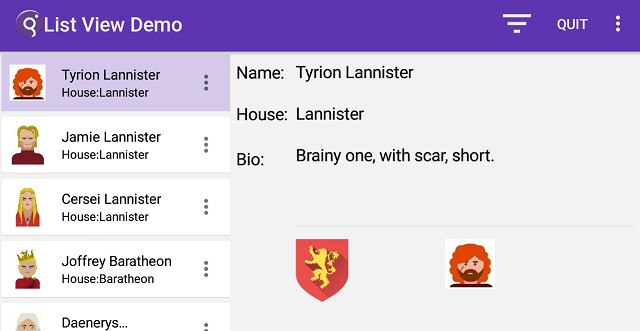
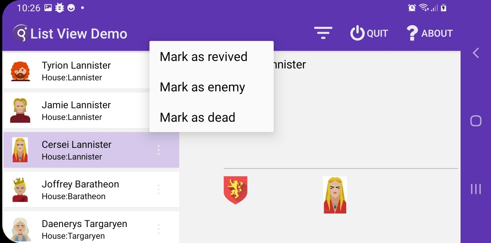
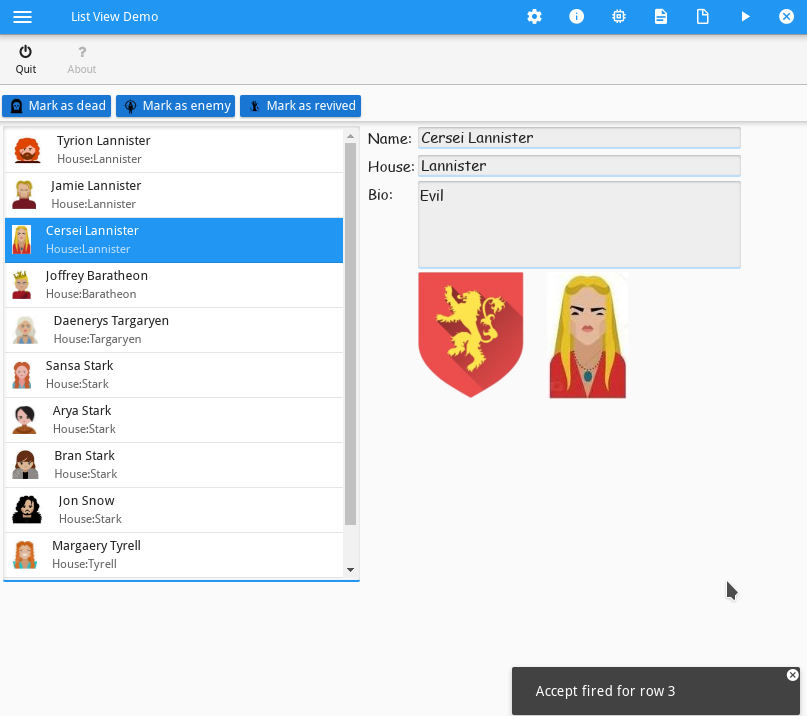

# ListView
listView is a style applied on table to render a desktop table as on a mobile table.</br>
```
<StyleAttribute name="tableType" value="listView" />
```
The table is rendered as a mobile list view.</br>
The style is only supported on GBC.

## GMA Native

## GMA Native ( my phone )



## GMA UR ( my phone )


## Mobile browser

## Mobile browser ( my phone )


## Desktop browser


## GDC UR Default


## GDC UR Custom ( how I'd really like it look in the GDC & Browser on all devices )


Some customers would like this same mobile feature but on desktop.</br>
The listView rendering looks ok but there are discrepancies on behaviors.</br>
For example, about **single** and **double click** or on **ROWBOUND**.

## Behaviors
- On desktop browser
    - if **no ROWBOUND** is set, the table actions are **NOT** displayed on any panel
    - if **ROWBOUND** is set, the table actions are **NOT** displayed on rows. Why ?
    - OK button **NOT** displayed on action panel. Why ?
    - double click is associated to accept
- On mobile browser
    - if **no ROWBOUND** is set, the table actions are **NOT** displayed on any panel
    - if **ROWBOUND** is set, the table actions are displayed on each row.
				( Actually I don't see that in Chrome on my phone, I don't get **ANY** views for my ROWBOUND actions! )
    - OK button **NOT** displayed on action panel. Why ?
    - doubleclick is not associated to accept. Why ? You need to add attribute DOUBLECLICK=accept.</br>
    Which then triggers the action on a single click.
- On mobile GMA/GMI native
    - if **no ROWBOUND** set, the table actions are displayed on the action panel
    - if **ROWBOUND** is set, the table actions are displayed on each row.
    - OK buttons displayed on action panel.
    - doubleclick is not associated to accept. Why ? You need to add attribute DOUBLECLICK=accept.</br>
    Which then triggers the action on a single click.

## Issues
- why is there no current line in the display array ?
You need to add style
```
<StyleAttribute name="highlightCurrentRow" value="yes" />
```
- What is the usage of style attribute **rowActionTrigger** compared to **DOUBLECLICK** ?
```
<StyleAttribute name="rowActionTrigger" value="singleClick" /> 
<StyleAttribute name="rowActionTrigger" value="doubleClick" />
```
